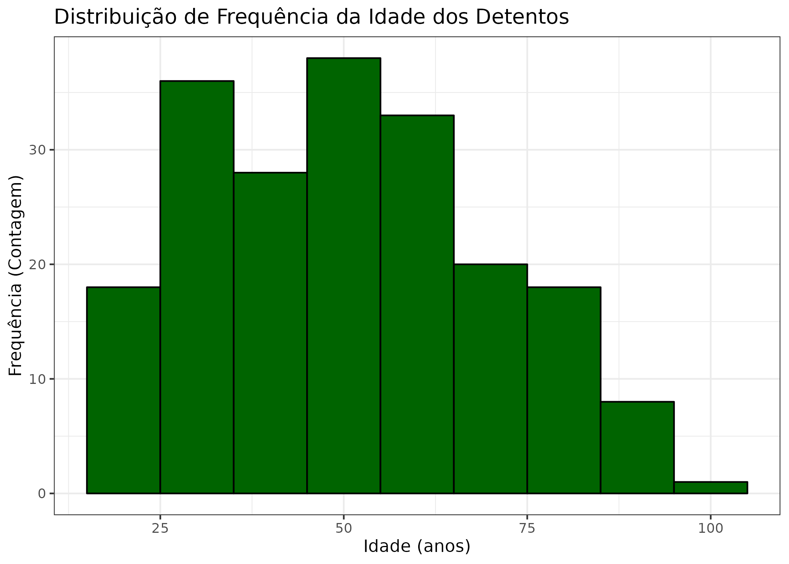
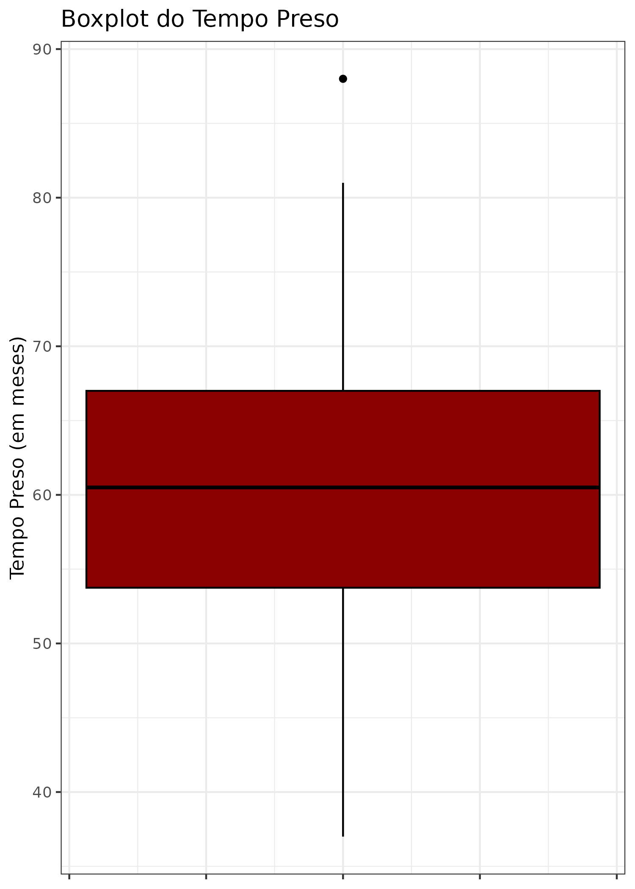
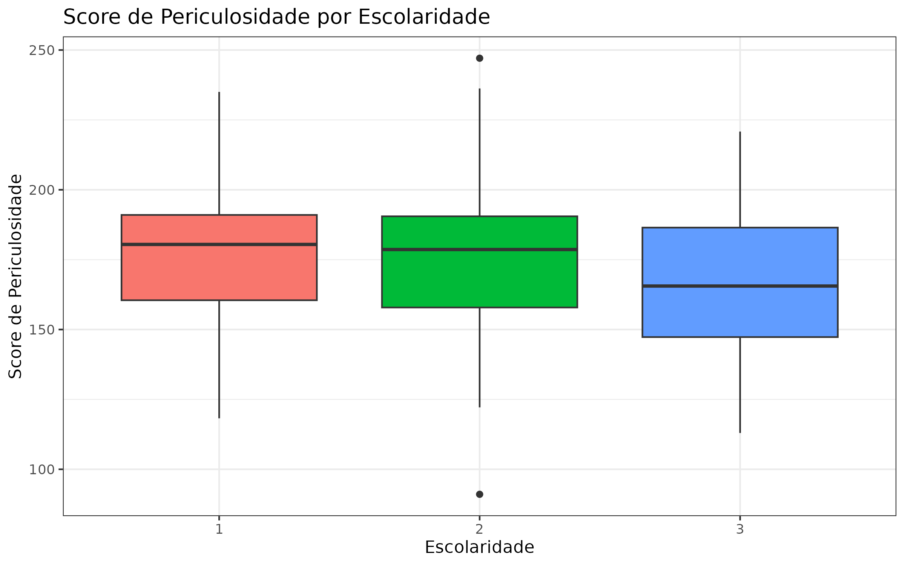
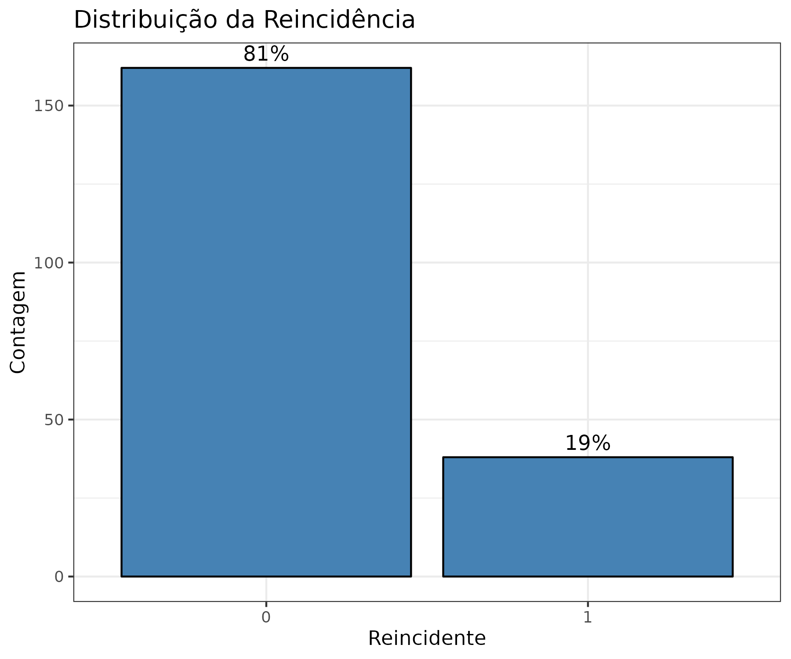

# AnaliseExploratoria.
1)Fazer um commit é o ato de salvar permanentemente as alterações que você 
preparou no histórico do seu repositório local.

2)## 📊 Resultados da Análise Gráfica

### Distribuição da Idade (Histograma)
O histograma da **Idade** (histograma_idade.png) exibe uma distribuição que 
aparenta ser pŕoxima a normal. A maior concentração de indivíduos (moda) 
situa-se na faixa etária de 45 a 60 anos.

### Boxplot do Tempo Preso
O boxplot do **Tempo Preso** (boxplot_tempo_preso.png) revela a dispersão dessa 
variável. A mediana (linha central da caixa) é de 
aproximadamente 60 meses. A amplitude interquartil (tamanho da caixa) indica 
que 50% dos detentos estão presos entre [Q1=54] e [Q3=67] meses. O gráfico também 
pode indicar a presença de *outliers* (97 meses), representando 
indivíduos com tempo de prisão excepcionalmente longo ou curto.

### Score de Periculosidade por Escolaridade
O boxplot que compara o **Score de Periculosidade** por **Escolaridade** 
(boxplot_score_escolaridade.png) sugere uma relação entre as variáveis. 
[O grupo com Escolaridade 'Fundamental'
apresenta uma mediana de score significativamente maior que o grupo 'Superior'].

### Distribuição da Reincidência (Gráfico de Barras)
O gráfico de barras para a variável **Reincidente** (grafico_reincidente.png) 
demonstra a proporção de indivíduos que cometeram crimes novamente. [ 81% não 
não tornam a cometer outros crimes].

## 🔢 Definições de Medidas Estatísticas Chave

Supondo que foram observados os valores $x_1, x_2, \dots, x_n$ em uma amostra:

### Medidas de Tendência Central

1.  **Média Aritmética ($\bar{x}$):**
    É a soma de todos os valores observados dividida pelo número total de
    observações ($n$). Representa o valor típico ou o ponto de equilíbrio do 
    conjunto de dados.
    $$\bar{x} = \frac{1}{n} \sum_{i=1}^{n} x_i$$
2.  **Mediana (Md):**
    É o valor que ocupa a posição central do conjunto de dados quando os dados
    são ordenados (crescente ou decrescente). A mediana divide a amostra em 
    duas partes iguais (50% dos valores são menores ou iguais a ela).

### Medidas de Dispersão

3.  **Variância ($s^2$):**
    Mede o quão dispersos os dados estão em relação à média. É calculada 
    como a média dos quadrados das diferenças de cada valor em relação à 
    média. É sensível a *outliers* e sua unidade de medida é o quadrado da
    unidade original.
    $$s^2 = \frac{1}{n-1} \sum_{i=1}^{n} (x_i - \bar{x})^2$$
4.  **Desvio Padrão ($s$):**
    É a raiz quadrada da variância. Mede a dispersão dos dados na mesma 
    unidade de medida das observações originais, facilitando a interpretação.
    $$s = \sqrt{s^2}$$
5.  **Amplitude (A):**
    É a medida de dispersão mais simples, calculada pela diferença entre o
    valor máximo e o valor mínimo observados no conjunto de dados.
    $$\text{Amplitude} = \text{Máximo} (x_i) - \text{Mínimo} (x_i)$$
---